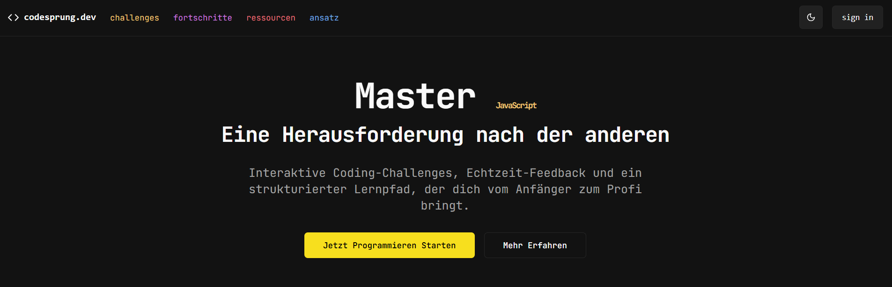

# codesprung.dev

**codesprung.dev** ist eine interaktive Lernplattform, die Entwicklern hilft, ihre JavaScript-Kenntnisse durch praxisnahe Coding-Challenges zu verbessern. Mit Echtzeit-Feedback und einem strukturierten Lernpfad bieten wir eine umfassende Umgebung für Anfänger und Fortgeschrittene.

# codesprung.dev

<div align="center">
  
  
  [](https://nextjs.org)
  [](https://www.typescriptlang.org)
  [](https://firebase.google.com)
</div>

**codesprung.dev** ist eine moderne, interaktive Lernplattform für JavaScript-Entwicklung. Durch praxisnahe Coding-Challenges, Echtzeit-Feedback und einen strukturierten Lernpfad unterstützen wir Entwickler aller Erfahrungsstufen dabei, ihre Programmierfähigkeiten zu verbessern.

## ✨ Hauptfunktionen

- 🎯 **Interaktive Challenges:** Praxisnahe Coding-Übungen mit sofortigem Feedback
- 📚 **Strukturiertes Lernen:** Systematischer Aufbau von Grundlagen bis zu fortgeschrittenen Konzepten
- 📊 **Fortschrittstracking:** Detaillierte Übersicht über deinen Lernfortschritt
- 🤝 **Community-Features:** Austausch mit anderen Lernenden und Experten
- 🌙 **Dark/Light Mode:** Optimierte Benutzeroberfläche für Tag und Nacht

## 🚀 Technologie-Stack

- **Frontend:**
  - [Next.js](https://nextjs.org) - React-Framework für SSR
  - [TypeScript](https://www.typescriptlang.org) - Typsicheres JavaScript
  - [Tailwind CSS](https://tailwindcss.com) - Utility-First CSS
  - [Framer Motion](https://www.framer.com/motion/) - Animationen
  - [Lucide React](https://lucide.dev/) - Icons

- **Backend & Services:**
  - [Firebase](https://firebase.google.com) - Auth & Datenbank
  - [Vercel](https://vercel.com) - Hosting & Deployment

## 🛠️ Installation

### Voraussetzungen

- Node.js (v18+ empfohlen)
- Ein Paketmanager: npm, yarn, pnpm oder bun

### Setup

1. Repository klonen

```bash
git clone https://github.com/codesprung/codesprung.dev.git
```

```bash
cd codesprung.dev
```

```bash
npm install
```
	
2. Abhängigkeiten installieren

```bash
npm install
```

3. Umgebungsvariablen setzen

```bash
cp .env.example .env
```

4. Entwicklungsserver starten

```bash
npm run dev
```

## 📁 Projektstruktur

codesprung.dev/
├── app/ # Next.js App Router
├── components/ # Wiederverwendbare UI-Komponenten
├── lib/ # Utilities und Helpers
├── public/ # Statische Assets
└── styles/ # Globale Styles


## 🤝 Mitwirken

Beiträge sind willkommen! Bitte lies unsere [Contribution Guidelines](CONTRIBUTING.md) für Details.

## 📝 Lizenz

Dieses Projekt ist unter der MIT-Lizenz lizenziert - siehe [LICENSE](LICENSE) für Details.

## 📧 Kontakt

- Website: [codesprung.dev](https://codesprung.dev)
- Email: [contact@codesprung.dev](mailto:contact@codesprung.dev)
- Twitter: [@codesprung](https://twitter.com/codesprung)

---

<div align="center">
  Mit 💻 entwickelt in Deutschland
</div>